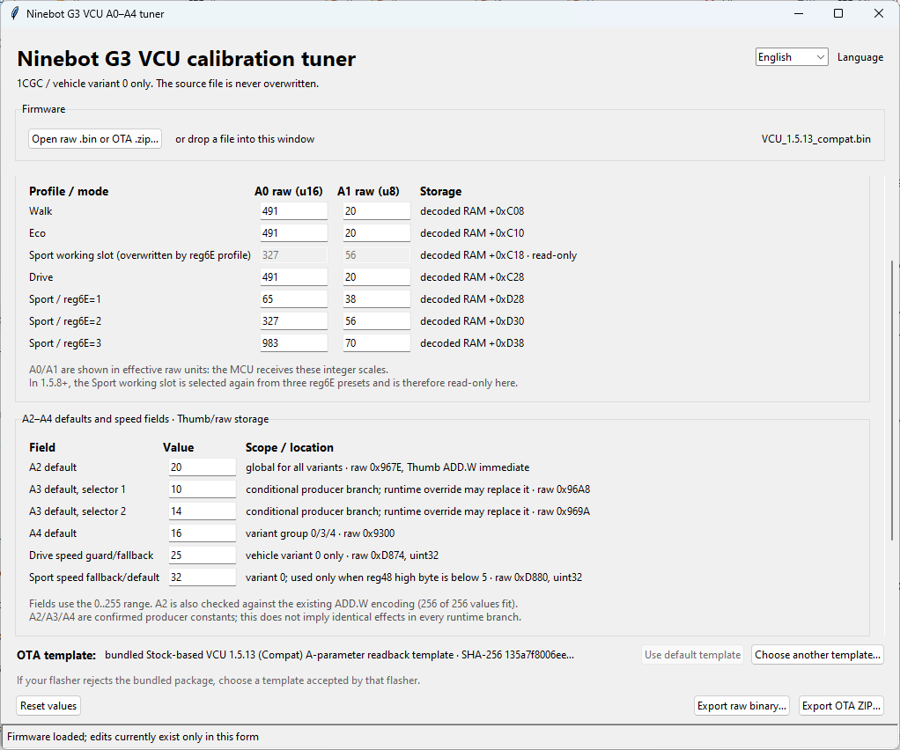

# Ninebot Max G3 VCU Calibration Tuner

[English](README.md) · **Русский**

Набор инструментов для настройки характера газа и электрического торможения Ninebot Max G3 без ручного поиска адресов в hex-редакторе.

Проект позволяет:

- временно менять A0–A4 на реальном самокате и считывать их через Android-приложение;
- подобрать подходящие лично вам значения;
- поместить их в штатные таблицы VCU, чтобы они применялись после каждого включения;
- собрать новый raw `.bin` или готовый OTA `.zip` с проверкой результата.

> [!WARNING]
> Сейчас тюнер предназначен только для **Ninebot Max G3 с model prefix `1CGC`, vehicle variant 0**. Допустимый диапазон числа не означает, что любое число в нём безопасно. A2–A4 затрагивают тормозящие и speed-related пути. Начинайте с небольших изменений и проверяйте их в контролируемых условиях.

Если нужен только практический маршрут: запустите [`run_vcu_tuner.cmd`](run_vcu_tuner.cmd), а для подбора параметров сначала прошейте [VCU 1.5.13 readback OTA](assets/ota_templates/VCU_readback_1.5.13.zip) и установите [VCU Runtime Lab](assets/VCU_Runtime_Lab.apk). Пошаговый порядок и важные ограничения описаны ниже.



*Так выглядит тюнер после загрузки распознанной VCU firmware: сверху находятся режимные A0/A1, ниже — A2–A4 и два поля скорости.*

## Зачем вообще менять VCU

Рукоятки газа и тормоза не передают мотору готовую «мощность». Сначала VCU обрабатывает положение ручек, выбранный режим, скорость и другие условия. Затем он формирует команды для MCU — контроллера, который уже управляет мотором.

```text
ручки и режимы → VCU → готовые команды по CAN → MCU → мотор
```

Часть настроек VCU хранится в сжатой служебной области прошивки. Ninebot менял её расположение и сами значения между релизами. Поэтому один и тот же raw offset нельзя бездумно переносить из одной версии в другую. Тюнер сам распознаёт поддерживаемый layout, распаковывает данные, меняет нужные поля и собирает их обратно.

## Что такое A0–A4

| Поле | Что удалось установить |
|---|---|
| **A0** | Задаёт характер нарастания тягового запроса. Большее normal-значение обычно быстрее раскрывает доступную тягу. Шкала нелинейна, а около `13108` меняется ветка алгоритма. Это не лимит мощности и не максимальный ток. |
| **A1** | Влияет на быстродействие одного из фильтров нарастания тяги. Чем больше A1, тем быстрее запрос следует за ручкой. Это тоже не «мощность». |
| **A2** | Масштаб ручного электрического торможения. На 1.5.6 штатное `A2=0` убирает именно этот компонент; `A2=20` возвращает его, что подтверждено на реальном самокате. Это не глобальный регулятор всей рекуперации. |
| **A3** | Отдельный тормозной/рекуперативный limit path. Известны штатные значения и условия их выбора, но точный пользовательский смысл ещё не доказан. |
| **A4** | Signed speed-related correction. Это экспериментальное поле: числа выше `127` имеют знаковый смысл, а не означают «ещё больше». |

Кратко: A0/A1 прежде всего меняют **динамику**, A2 — один из путей **ручного электротормоза**, а A3/A4 пока стоит считать advanced/исследовательскими. Одинаковые A-значения не обязаны давать одинаковый эффект на другой версии VCU/MCU.

### Что означают два speed field

Тюнер также показывает **Drive speed guard/fallback** и **Sport speed fallback/default**. Это числа из штатных таблиц VCU для `variant 0`, которые используются как начальные или запасные значения только в определённых ветках логики. Они не обязательно совпадают с текущим лимитом, уже сохранённым в самокате.

Диапазон поля `0…255` описывает только размер его хранения. Запись `100` не является командой «ехать 100 km/h» и сама по себе не снимает остальные ограничения. Текущий speed-регистр может сохранить прежнее значение, штатное приложение может не позволить выбрать больше своего предела, а в firmware остаются отдельные проверки. Для скорости выше штатной нужны отдельно установленный текущий лимит и VCU firmware, проверки которой допускают это значение. Тюнер изменяет только показанные table default/fallback и не обещает выполнить весь этот набор действий.

## Два способа настройки

### 1. Временный runtime override

В VCU есть штатный механизм, который заменяет A0–A4 в работающей RAM. Вероятно, Ninebot использовал его для отладки и подбора калибровок. Переопределения A0–A4 исчезают после перезагрузки VCU. Обычная настройка Acceleration mode (`reg6E`) хранится отдельно и может сохраняться.

Управлять override можно через [VCU Runtime Lab](assets/VCU_Runtime_Lab.apk). Приложение не пишет автоматически: сначала оно требует свежее чтение, затем отдельное нажатие кнопки записи и после записи ещё раз считывает фактическое значение.

В карточке каждого параметра показаны разные уровни одного и того же значения:

| Надпись | Что она означает |
|---|---|
| **Override / Saved** | Число в служебном runtime-слоте VCU. Слово Saved здесь не означает сохранение во flash: после перезагрузки это значение теряется. |
| **valid** | Признак того, участвует ли runtime-слот в выборе параметра. При `valid=0` override игнорируется, даже если рядом осталось ненулевое число. При `valid≠0` VCU выбирает override вместо обычного значения для этого поля. |
| **Effective VCU** | Значение, которое VCU фактически выбрал сейчас: из штатной таблицы/профиля при `valid=0` либо из override при `valid≠0`. Именно его нужно сравнивать до и после записи. |

Например, `Override=0, valid=0, Effective VCU=491` означает: никакой override не активен, а рабочее значение `491` пришло из обычной калибровки. Это не означает, что VCU использует ноль. После успешной записи числа `12644` приложение должно показать активный `valid` и `Effective VCU=12644` — если для этого поля не сработала дополнительная логика выбора или проверка.

`Effective VCU` подтверждает выбор на стороне VCU, но не обещает линейный физический эффект и не означает, что MCU дальше никак не ограничивает или не интерпретирует поле. Чтобы убрать временные override, перезагрузите VCU и снова убедитесь, что `valid=0`. Запись числа `0` не равнозначна отключению: ноль сам может быть активным значением со специальным поведением.

Стоковая VCU умеет принимать команды override, но не умеет безопасно возвращать их через тот же диагностический интерфейс. Поэтому Runtime Lab преднамеренно блокирует A0–A4, если нет подтверждённой readback firmware.

### 2. Постоянная калибровка

Desktop-тюнер меняет штатные начальные значения в самой firmware. После прошивки они применяются без Runtime Lab и без повторной настройки после каждого включения.

Исходный файл никогда не перезаписывается. Рядом с результатом создаётся audit JSON с исходным/итоговым hash и перечнем изменений.

## Рекомендуемый порядок работы

1. Убедитесь, что у вас Max G3 с prefix `1CGC` / variant 0.
2. Прошейте [stock-based VCU 1.5.13 readback OTA](assets/ota_templates/VCU_readback_1.5.13.zip). Он собран из чистой 1.5.13 Compat; единственное изменение firmware — перенос базы diagnostic readback.
3. Установите [VCU Runtime Lab APK](assets/VCU_Runtime_Lab.apk), подключитесь к самокату и подтвердите, что установлена именно readback firmware. Приложение не может само проверить SHA-256 VCU.
4. Считайте текущие saved/effective значения. Меняйте по одному параметру и записывайте результаты. Для A2–A4 учитывайте влияние на торможение.
5. После перезагрузки VCU runtime overrides исчезнут. Повторите опыт, чтобы убедиться, что наблюдаемый эффект связан именно с выбранным полем.
6. Откройте тот же readback ZIP в desktop-тюнере, внесите подобранные значения в штатные поля и экспортируйте новый OTA ZIP.
7. Прошейте его и ещё раз считайте значения через Runtime Lab. Так можно убедиться, что в таблицу попали именно нужные числа, а overrides неактивны.

Readback OTA и собранный из него OTA уже прошивались на реальном самокате; readback вернул ожидаемые параметры.

## Запуск desktop-тюнера

Нужен Python 3 с Tkinter. На Windows дважды щёлкните `run_vcu_tuner.cmd` или выполните:

```powershell
py -3 run_vcu_tuner.py
```

На Linux/macOS:

```bash
python3 run_vcu_tuner.py
```

При первом запуске launcher тихо установит `tkinterdnd2` из `requirements.txt` в user site. В virtualenv пакет устанавливается в сам environment. Если pip или сеть недоступны, тюнер всё равно откроется, но drag and drop внутрь окна будет отключён. На некоторых Linux-системах Tkinter устанавливается отдельным системным пакетом `python3-tk`.

Для обычной сборки OTA не нужно искать template вручную. Для raw input используется bundled readback OTA container; если загружен OTA ZIP, он сам становится template. Всегда можно выбрать другой ZIP.

> [!IMPORTANT]
> Template предоставляет OTA-оболочку. При экспорте его `FIRM.bin` целиком заменяется firmware, которую вы открыли в тюнере. Если открыть stock 1.6.2, на выходе будет 1.6.2 без readback-патча. Чтобы сохранить readback в итоговой 1.5.13, откройте в тюнере сам `VCU_readback_1.5.13.zip`.

## Поддерживаемые firmware

| VCU | Режим |
|---|---|
| 1.4.8, 1.5.4 | Только просмотр известных exact-stock SHA-256: параметры там заданы константами кода. |
| 1.5.5, 1.5.6 | Редактирование табличных A0/A1, A2–A4 и speed fields в пределах подтверждённого layout. |
| 1.5.8, 1.5.13, 1.5.15, 1.6.1, 1.6.2 | То же, плюс три Sport/Acceleration presets `reg6E=1/2/3`. |

Все девять exact-stock binaries уже лежат в [assets/VCU_Stock_Firmware](assets/VCU_Stock_Firmware/). Их размеры и SHA-256 указаны в [manifest](assets/VCU_Stock_Firmware/manifest.json). В этой папке нет mod, readback или tuned images.

<details>
<summary><strong>Штатные A-значения для 1CGC / variant 0</strong></summary>

| VCU | Walk/Eco/Drive A0/A1 | Sport A0/A1 | A2 | A3 selector 0/1/2 | A4 | Drive fallback | Sport fallback |
|---|---:|---:|---:|---:|---:|---:|---:|
| 1.4.8 | 327/20 | 327/20 | 40 | 0/15/18 | 16 | 25 | — |
| 1.5.4 | 491/20 | 491/20 | 0 | 0/10/14 | 16 | 25 | — |
| 1.5.5 | 491/20 | 327/50 | 0 | 0/10/14 | 16 | 25 | 32 |
| 1.5.6 | 491/20 | 327/56 | 0 | 0/10/14 | 16 | 25 | 32 |
| 1.5.8 | 491/20 | 65/38, 327/56, 983/70 | 20 | 0/10/14 | 16 | 25 | 32 |
| 1.5.13 | 491/20 | 65/38, 327/56, 983/70 | 20 | 0/10/14 | 16 | 25 | 32 |
| 1.5.15 | 491/20 | 65/38, 327/56, 983/70 | 30 | 0/10/14 | 16 | 25 | 32 |
| 1.6.1 | 491/20 | 65/38, 327/56, 983/70 | 30 | 0/10/14 | 16 | 25 | 32 |
| 1.6.2 | 491/20 | 65/38, 327/56, 983/70 | 30 | 0/10/14 | 16 | 25 | 32 |

Для 1.5.8+ три Sport-пары соответствуют Acceleration mode: Energy saving / Standard / Max. speed. Рабочая Sport-пара копируется из выбранного preset.

Drive/Sport fallback — не обязательно текущая сохранённая скорость. VCU использует эти числа только при определённых условиях.

</details>

## FAQ

<details>
<summary><strong>«Я записал 100 в speed field, но скорость не изменилась»</strong></summary>

Поля Drive и Sport в тюнере — штатные default/fallback values, а не универсальная кнопка снятия всех ограничений.

- В VCU может уже храниться другое runtime-значение.
- Штатное приложение или SHU могут ограничивать свой ползунок.
- В stock VCU остаются отдельные code-level guards. Например, Sport fallback сам по себе не обходит штатный предел 45.

Для Drive новый потолок может потребовать отдельной записи текущего speed-регистра средствами, которые умеют это делать. Тюнер не обещает превратить любой stock firmware в «100 km/h mod».

</details>

<details>
<summary><strong>«Значит, для максимально резкого газа нужно поставить A0=65535?»</strong></summary>

Нет. Шкала A0 нелинейна. `0` и значения выше `32768` включают fallback-поведение MCU, а около `13108` меняется ветка алгоритма. Цифра `65535` означает только то, что поле имеет размер 16 бит. Это не рекомендация и не «максимум» по эффекту.

Та же осторожность нужна с A1–A4: диапазон `0…255` описывает формат поля, а A4 к тому же интерпретируется как signed byte.

</details>

<details>
<summary><strong>«Можно ли загрузить дамп, считанный программатором с моего самоката?»</strong></summary>

Обычно полный дамп flash не является тем raw `FIRM.bin`, который ожидает тюнер: у него могут быть другой размер, base address, bootloader и другие области. Не обрезайте дамп наугад.

Если GUI распознал файл, проверил его layout и показал параметры, его можно использовать в поддерживаемых рамках. Если файл отклонён, это не проблема, которую нужно «обойти»: сначала нужно точно выделить VCU image и доказать его структуру.

</details>

<details>
<summary><strong>«Тюнер сообщает, что IAR block не помещается»</strong></summary>

Значения A0/A1 внутри firmware хранятся как float, а разные наборы битов сжимаются по-разному. Иногда новая комбинация на несколько байтов не помещается в доступное место.

Немного измените одно или несколько A0/A1 и повторите экспорт. Тюнер сам выводит эту подсказку и не создаёт обрезанную или перекрывающую соседние данные firmware.

</details>

<details>
<summary><strong>«Почему одинаковые A0/A1 не делают Eco, Drive и Sport одинаковыми?»</strong></summary>

A0/A1 — только часть командной цепочки. VCU передаёт и другие mode/speed/limit fields, а MCU содержит отдельные режимные профили и guards. Одинаковая пара A0/A1 не превращает все режимы в Drive или Sport.

</details>

<details>
<summary><strong>«Одинаковые цифры будут одинаково работать на 1.5.13 и 1.6.2?»</strong></summary>

Не обязательно. Тюнер доказывает, что числа попали в нужные поля конкретной firmware. Он не может доказать, что вокруг этих полей не изменились другие фильтры, limits и логика. Если вы подбирали значения на 1.5.13, переносите их в другую версию как новую гипотезу, а не как гарантированный эквивалент.

</details>

## Что проверяет тюнер

- Известные stock/mod/readback файлы распознаются по SHA-256.
- Для изменённых производных дополнительно проверяются descriptor, длина распакованных данных, границы таблиц, ссылки на speed table и формы нужных Thumb-инструкций.
- Неизвестный или неоднозначный layout отклоняется.
- Исходный файл и уже существующий output никогда не перезаписываются.
- После упаковки IAR block снова распаковывается, а запрошенные значения сравниваются с фактическим readback.
- Если новые float плохо сжимаются и не помещаются, экспорт отклоняется без обрезания соседних данных.
- Для OTA обновляется `firmware.md5`, сам ZIP повторно читается, а metadata `displayName` соответствует фактической input firmware.

<details>
<summary><strong>Зависимости и воспроизводимость bundled assets</strong></summary>

Внешние Python-зависимости:

```bash
python -m pip install --user -r requirements.txt
```

Встроенный readback OTA и stock assets собираются воспроизводимыми скриптами из `tools/`. Скрипты принимают только exact source SHA-256.

</details>

## Состав репозитория

- `vcu_tuner/` — GUI и backend проверки/пересборки firmware.
- `assets/VCU_Stock_Firmware/` — подтверждённые stock VCU.
- `assets/ota_templates/` — clean-stock VCU 1.5.13 readback OTA.
- `assets/VCU_Runtime_Lab.apk` — Android-клиент для runtime-подбора.
- `tools/` — воспроизводимая сборка bundled assets.

Проект исследовательский. Он не отменяет физические пределы самоката, не обходит все code-level guards и не гарантирует одинаковое поведение на другой модели или версии firmware.
